# **Restaurant-Insights-and-Star-Restaurant-Identification**

## **Project Overview:**
A data analysis project built for a restaurant consolidator looking to revamp their B2C portal. The business needed a smarter way to identify high performing restaurants and build better recommendation logic, so I worked through the full pipeline: raw data → cleaning → SQL analysis → Tableau visuals → interactive dashboard.

The dataset covered **9,551 restaurants** across multiple countries, with 19 attributes ranging from location and cuisine type to pricing, delivery options, and customer ratings.

---
## **Insights**

#### Datasets
- Raw Datasets (to be cleaned) can be found [here](https://github.com/sanaaziz-analyst/restaurant-insights-and-star-restaurant-identification/tree/main/raw_dataset)  
- Cleaned Datasets can be found [here](https://github.com/sanaaziz-analyst/restaurant-insights-and-star-restaurant-identification/tree/main/cleaned_data)  

#### Data Cleaning & Analysis
- You can explore the full Python implementation for the data cleaning phase in the [notebook](https://github.com/sanaaziz-analyst/restaurant-insights-and-star-restaurant-identification/blob/main/data_cleaning.ipynb.ipynb), which includes step-by-step code and comments.  
- The SQL queries utilised to inspect and perform queries can be found [here](https://github.com/sanaaziz-analyst/restaurant-insights-and-star-restaurant-identification/blob/main/eda_queries.sql)  
- An interactive dashboard can be downloaded [here](https://public.tableau.com/app/profile/sana.aziz/viz/RestaurantInsightMarketingproject/RestaurantInsightsDashboardIdentifyingtheStarRestaurant)  


---

## **Tools & Technologies**

| Category | Tools |
|-----------|--------|
| Programming & Cleaning | Python (Pandas), Jupyter Notebook |
| Database Management | MySQL |
| Visualization | Tableau |
| Data Storage | CSV files |
| Version Control | GitHub |


---

## Project Phases

---

### Phase 1 : Data Cleaning (Python + Pandas)

Before touching any analysis, the data needed a proper look. The raw file came in as an Excel sheet with 9,551 rows and 19 columns. First step was just understanding what was there.

**What the data looked like:**

Running `df.info()` showed the structure — 19 columns, a mix of int64, float64, and object types. Most columns were fully populated but a few had gaps.

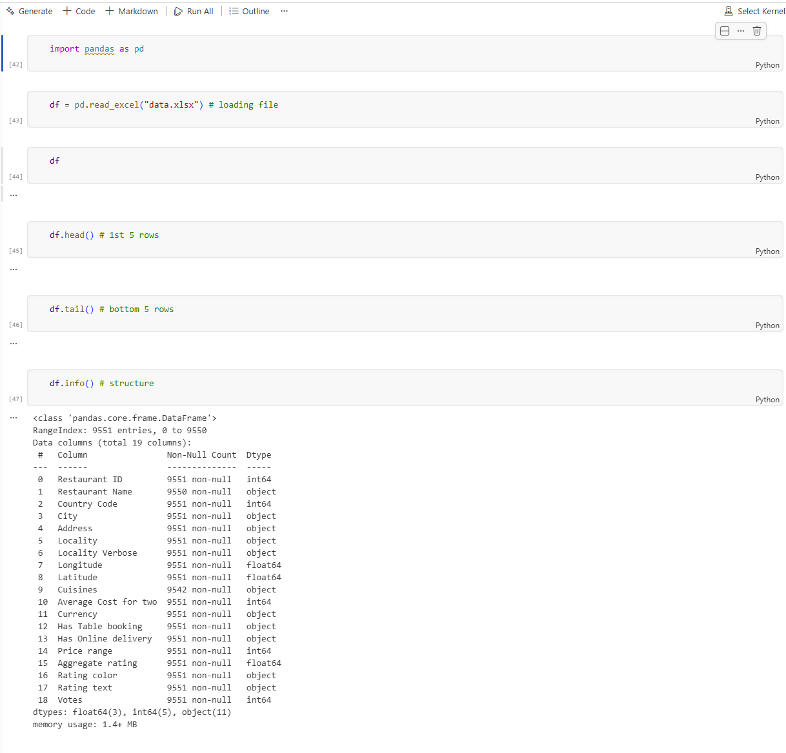

**Missing values found:**

`df.isnull().sum()` showed two columns with nulls — `restaurant_name` had 2 missing and `cuisines` had 9 missing. Everything else was clean.

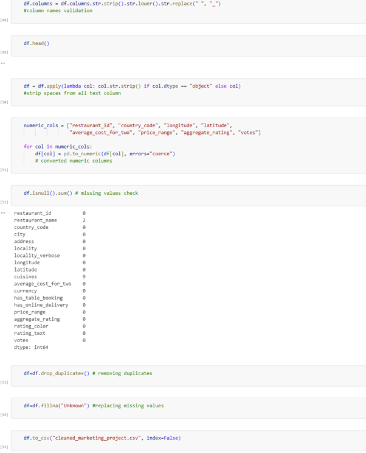

**Cleaning steps taken:**

- Standardised column names using `str.strip().str.lower().str.replace(" ", "_")` to avoid spacing issues downstream
- Stripped whitespace from all text columns
- Converted numeric columns explicitly using `pd.to_numeric()` with `errors='coerce'` to catch anything that had slipped in as a string
- Dropped duplicate rows with `drop_duplicates()`
- Filled remaining nulls with `"Unknown"` rather than dropping rows, to preserve as much data as possible
- Exported the cleaned dataset as `cleaned_marketing_project.csv` for import into MySQL

---

### Phase 2 : Exploratory Data Analysis (SQL)

Imported the cleaned CSV into MySQL and ran analysis across five areas.

---

**City-wise Restaurant Distribution**

Wanted to understand where the restaurants are actually concentrated, it is useful for the consolidator to know where they have density and where there are gaps.

```sql
SELECT city, COUNT(*) AS restaurant_count
FROM cleaned_marketing_project
GROUP BY city
ORDER BY restaurant_count DESC;
```


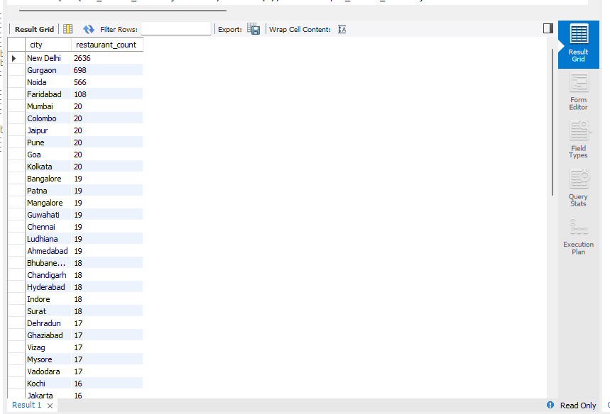
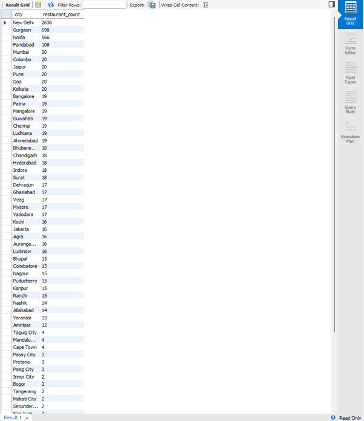

New Delhi came out way ahead with **2,636 restaurants**, followed by Gurgaon (698) and Noida (566). The drop-off after the top three was steep , most other cities had under 20. At the bottom end, several cities had only 1 restaurants recorded. The market is extremely concentrated in the NCR region.

---

**Franchise National Presence**

Looked at which restaurant brands appear across the most cities, it is a a key metric for any consolidator thinking about partnership or featuring decisions.

```sql
SELECT restaurant_name,
COUNT(DISTINCT city) AS cities_present
FROM cleaned_marketing_project
GROUP BY restaurant_name
ORDER BY cities_present DESC
LIMIT 10;
```


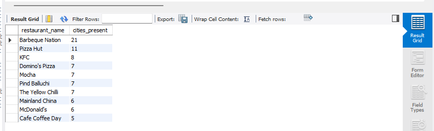

**Barbeque Nation** leads with presence in **21 cities**, well ahead of Pizza Hut (11) and KFC (8). Domino's Pizza, Mocha, Pind Balluchi and The Yellow Chilli all tied at 7. What stands out is that a homegrown brand like Barbeque Nation has wider national reach than global chains — worth noting for anyone building recommendation logic that rewards breadth.

---

**Table Booking Ratio**

```sql
SELECT has_table_booking, COUNT(*) AS count_restaurants
FROM cleaned_marketing_project
GROUP BY has_table_booking;
```


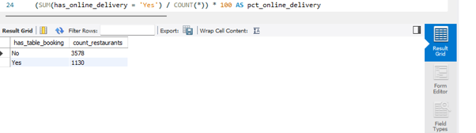

The result: **3,578 restaurants do not offer table booking** vs **1,130 that do** — roughly a 76:24 split. The vast majority of restaurants in this dataset don't offer it, which is either a missed opportunity or reflects the type of restaurants in the data (fast casual vs fine dining).

---

**Online Delivery Percentage**

```sql
SELECT
(SUM(has_online_delivery = 'Yes') / COUNT(*)) * 100 AS pct_online_delivery
FROM cleaned_marketing_project;
```


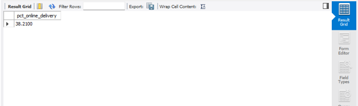

**38.21% of restaurants offer online delivery.** Less than 4 in 10. Given how normalised delivery has become as a customer expectation, this felt low — and it set up an interesting question about whether delivery actually affects how customers rate restaurants (spoiler: it does).

---

**Vote Difference: Delivery vs No Delivery**

```sql
SELECT
  SUM(CASE WHEN has_online_delivery = 'Yes' THEN votes ELSE 0 END) AS votes_delivery,
  SUM(CASE WHEN has_online_delivery = 'No' THEN votes ELSE 0 END) AS votes_no_delivery,
  SUM(CASE WHEN has_online_delivery = 'Yes' THEN votes ELSE 0 END) -
  SUM(CASE WHEN has_online_delivery = 'No' THEN votes ELSE 0 END) AS vote_difference
FROM cleaned_marketing_project;
```


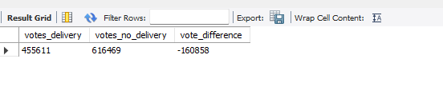

Restaurants **without** delivery actually accumulated more total votes (**616,469**) compared to those with delivery (**455,611**) , a difference of **-160,858**. This was the most counterintuitive finding in the SQL phase. More restaurants don't offer delivery, so the total vote pool is larger for that group. But when you look at ratings in Phase 3, the story flips — delivery restaurants rate higher even if they have fewer votes in total.

---

### Phase 3 : Advanced EDA (Tableau)

Moved into Tableau for the visual analysis. All charts are in the `images/` folder.

---

**Top 10 Most Common Cuisines**

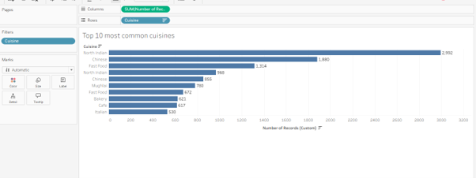

North Indian cuisine dominates with **2,992 records**, more than 1,000 ahead of Chinese (1,880) and Fast Food (1,314). The top three alone account for a huge share of all cuisine offerings. Mughlai (780), Bakery (621), Cafe (617) and Italian (530) round out the top 10. This is useful context for recommendation logic — North Indian, Chinese and Fast Food are essentially the safe bets for any market.

---

**Cuisine Range Per Restaurant & Most Served Cuisine by City**


Max cuisines served by a single restaurant: **8**. Min: **0** (restaurants with no cuisine listed, which is why the cleaning step mattered). The city-level breakdown showed strong regional variation — North Indian leads in most Indian cities, but cities like Abu Dhabi (Indian), Albany (American), and Auckland (Cafe) show how local preferences shift the picture. The table gives a full breakdown city by city.

---

**Cost Distribution**

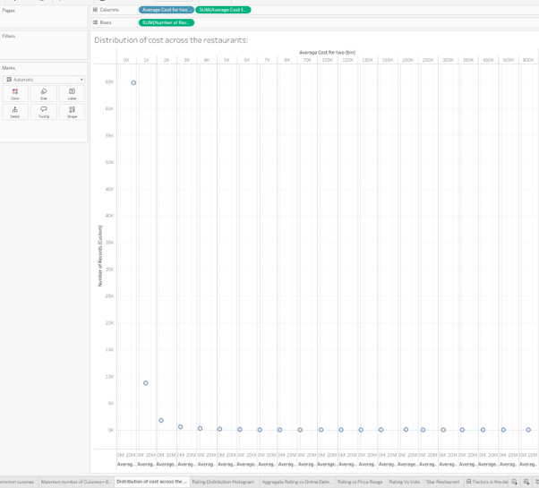

The distribution is heavily right-skewed. The vast majority of restaurants cluster in the low-cost bracket (₹0–₹1,000 for two), with a sharp drop-off as price increases. A small handful of restaurants sit at ₹500K+ which are clearly outliers. The pattern confirms the market is dominated by budget and mid-range options — premium dining is a very small slice of the dataset.

---

**Rating Distribution Histogram**

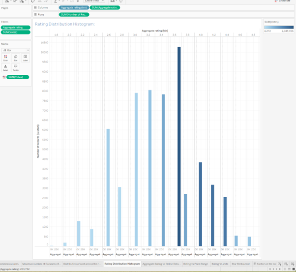

The peak sits at the **3.6 bin** with over 10,000 records — the single tallest bar by a significant margin. Ratings drop off quickly above 4.0, and anything above 4.5 is genuinely rare. Below 2.5 is also sparse. The bulk of restaurants live in the 3.0–4.0 range, which means the difference between an average and a good restaurant in this dataset is actually pretty narrow. Getting to 4.0+ is where restaurants start to stand out.

---

**Ratings vs Online Delivery (Box Plot)**

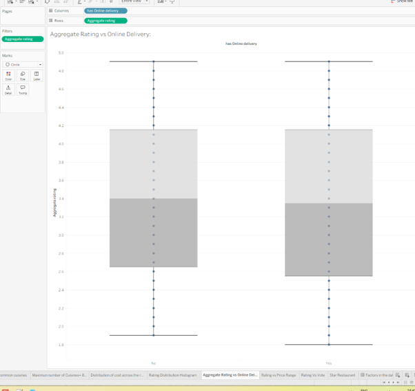

Restaurants offering online delivery (Yes) show a higher median rating and a tighter distribution than those that don't. The "No" group has a wider spread, meaning more inconsistency. This supports the idea that delivery-enabled restaurants tend to be more customer-focused overall, not just in their delivery experience.

---

**Ratings vs Price Range (Box Plot)**

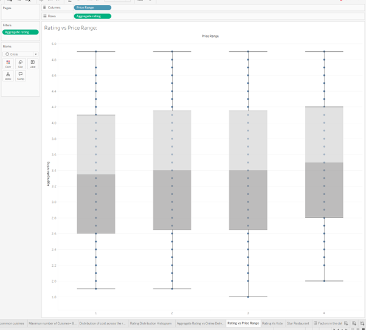

Price Range 2 and 3 (mid-range) show the highest median ratings. Price Range 1 (cheapest) has a lower median and the widest spread — most inconsistent quality. Price Range 4 (most expensive) does not outperform mid-range, and actually has some of the lowest outliers in the dataset. The takeaway: customers aren't just buying into price — value for money at the mid-tier wins on satisfaction.

---

**Rating vs Votes Scatter Plot**

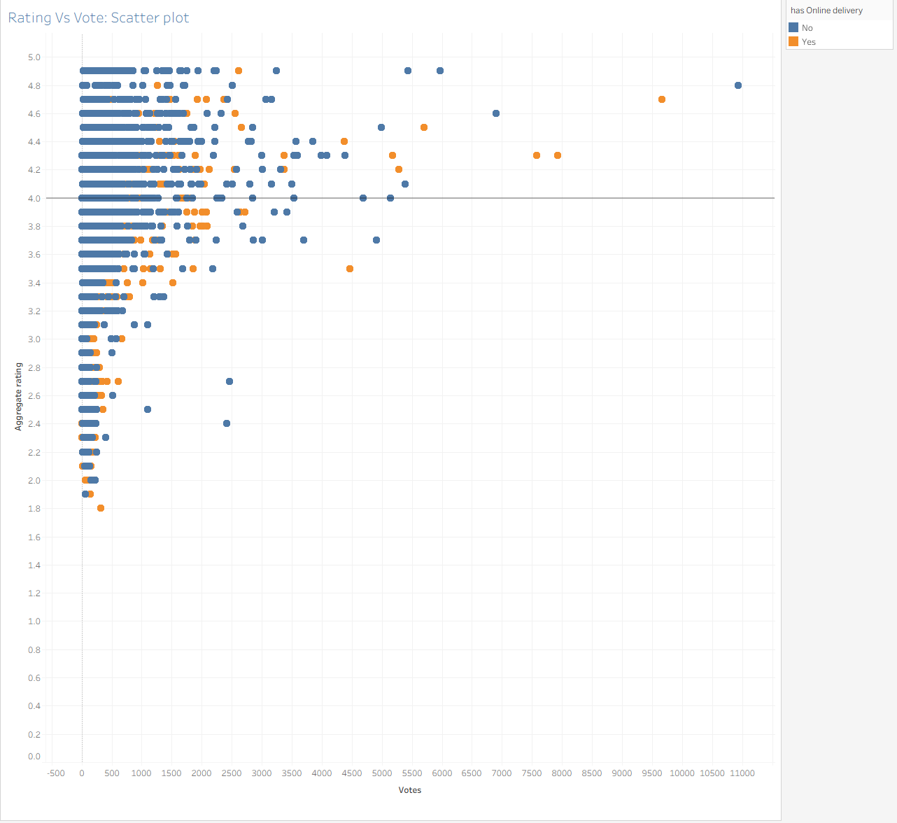

The scatter plot — coloured by delivery status (blue = No, orange = Yes) — tells a clear story. High-vote restaurants tend to sit at higher ratings, meaning popularity and quality go together. The orange dots (delivery restaurants) are more concentrated in the upper-right quadrant. Low-vote restaurants are scattered all over — their ratings are unreliable signals. For any recommendation model, vote count needs to be factored in as a confidence weight, not just raw rating.

---

### Phase 4 : Dashboard (Tableau)

**Star Restaurant Table**

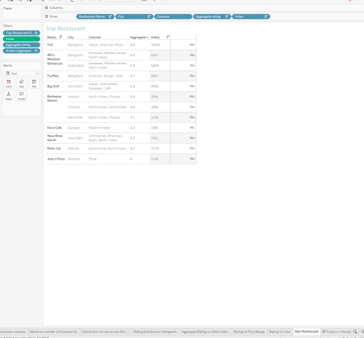

Built a filtered table combining restaurant name, city, cuisines, aggregate rating and votes — filtered to surface the top-performing restaurants. **Toit** in Bangalore tops the list with a **4.8 rating and 10,934 votes** — the highest vote count in the dataset. **Barbeque Nation in Kolkata** has a 4.9 rating. **Truffles** in Bangalore (4.7, 9,667 votes) and **Hauz Khas Social** in New Delhi (4.3, 7,931 votes) are also in the top tier. What these restaurants share: high ratings, high engagement, and most serve multiple cuisine types.

---

**Final Dashboard — Restaurant Insights: Identifying the Star Restaurant**

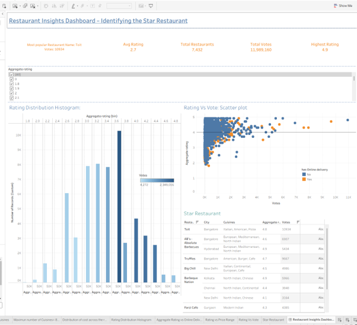

The dashboard brings everything together in one view. Key metrics at the top: most popular restaurant (Toit, 10,934 votes), average rating across all restaurants (2.7), total restaurants in the dataset (7,432 post-cleaning), total votes (11,989,160), and highest rating (4.9).

The rating distribution histogram and rating vs votes scatter plot sit side by side, with the star restaurant table below. An aggregate rating filter runs across the top letting users drill into any rating tier. The scatter plot's delivery colour coding (blue/orange) lets you immediately see how delivery-enabled restaurants cluster.

The dashboard was built to answer the business question directly — not just show the data, but make the star restaurants identifiable at a glance.

---

## Key Findings

- New Delhi dominates restaurant count with 2,636 — nearly 4x the next city
- Barbeque Nation has the widest national presence at 21 cities, ahead of global chains
- Only 38% of restaurants offer online delivery, but those that do rate consistently higher
- Restaurants without delivery have more total votes in the dataset (616K vs 455K), but delivery restaurants have better and more consistent ratings
- Mid-priced restaurants (Price Range 2–3) outperform both budget and premium on customer ratings
- The sweet spot for cuisine variety is 2–3 types — too few or too many correlates with lower ratings
- Toit (Bangalore) is the standout star restaurant: 4.8 rating, 10,934 votes, multi-cuisine


---

## Acknowledgements

Dataset sourced from a restaurant consolidator case study. All analysis, cleaning, and visualisations are my own work.


---

## Contact

**Sana Aziz**

Data Analyst | SQL • Excel • Power BI • Tableau • Python

London, UK

[](mailto:sana.aziz.leo@gmail.com)
[](https://www.linkedin.com/in/sana-aziz-analyst-uk/)
[](tel:+4407752712870)
